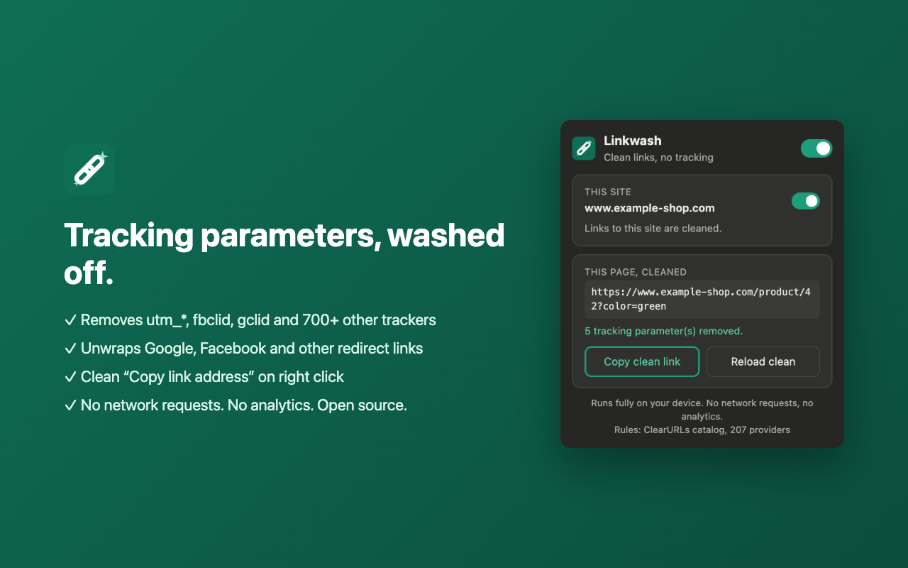
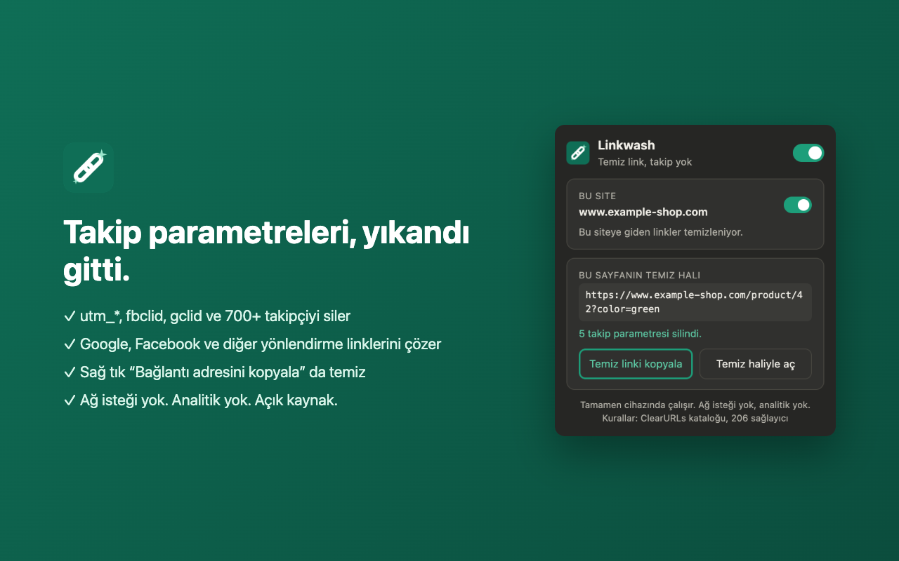

<p align="center"></p>

# Linkwash

A Manifest V3 successor to ClearURLs for Chrome. Linkwash strips tracking parameters (`utm_*`, `fbclid`, `gclid` and 700+ more) and unwraps redirect links (Google, Facebook and dozens of others). It uses the rule catalog maintained by the [ClearURLs](https://github.com/ClearURLs/Rules) community, plus its own [extra rules](rules/EXTRA.md) for ad-click IDs the catalog misses (Search Ads 360 `ds_*`, `gbraid`/`wbraid`, TikTok, LinkedIn, Pinterest, Reddit and others).

ClearURLs was removed from the Chrome Web Store with the other Manifest V2 extensions, which left about 37,000 Chrome users without it. Linkwash reimplements the extension for Manifest V3 and keeps using the same community rule catalog.

## Screenshots

| English | Türkçe |
|---|---|
|  |  |

## How it works

The cleaning happens in two layers:

1. **Network level (declarativeNetRequest).** At build time, every parameter name that can be written literally is turned into a static DNR rule. Chrome then removes these parameters before the request leaves the browser. Complete-provider rules, which cover ad and tracking domains, are blocked outright. Provider exceptions become higher-priority allow rules.
2. **Engine.** `src/engine.js` is a small, dependency-free implementation of the ClearURLs rule semantics. It handles what DNR cannot: parameters defined by regex, raw rules, and redirect unwrapping. It runs in two places:
   - In the content script, it cleans a link the moment you press, click, middle-click or right-click it. That means *Copy link address* already gives you the clean URL. It also removes the `ping` attribute from links.
   - In the service worker, it catches top-level navigations and fixes anything DNR could not.

## Privacy

- Linkwash makes **no network requests**.
- It collects no data and has no analytics or accounts.
- Settings (the on/off switch and the list of paused sites) are kept in `chrome.storage.local`.

New rules arrive with extension updates. A weekly GitHub Action pulls the latest ClearURLs catalog and publishes a new version when it has changed.

## Features

- A global on/off switch.
- Pause on a site: links to that site are left as they are.
- A badge showing how many parameters were removed on the current tab.
- "Copy clean link" in the right-click menu (for links and for the current page) and in the popup.
- The interface is in English and Turkish.

## Development

```sh
npm install            # puppeteer, used only for the end-to-end test
npm run build          # rules/clearurls-data.min.json -> providers.js + dnr_rules.json
npm test               # engine unit tests (node:test)
npm run test:e2e       # loads the extension into Chrome for Testing and checks real navigations
npm run update-rules   # download the latest ClearURLs catalog and rebuild
npm run package        # linkwash.zip for the Chrome Web Store
```

To load it locally, open `chrome://extensions`, turn on Developer mode, click *Load unpacked* and choose this folder.

## License

The code is under the MIT license, see [LICENSE](LICENSE). The rule catalog in `rules/` and the files generated from it are under LGPL-3.0, see [rules/NOTICE.md](rules/NOTICE.md). Linkwash is not affiliated with the ClearURLs project.
